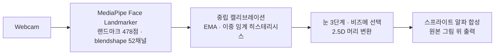

# 🐷 DrawFace Live

**손그림 한 장이 웹캠 표정을 실시간으로 따라 합니다.**
원본 그림의 획은 그대로 두고 눈·입 스프라이트만 교체 합성 — 화풍이 변형 없이 유지됩니다.

[](https://ingon1026.github.io/drawface-live/)
[](https://ai.google.dev/edge/mediapipe)


<sub>온보딩한 캐릭터가 윙크·깜빡임·입 벌림을 실시간으로 따라 합니다. 아래는 동일 획 위에서 상태만 교체되는 예시입니다.</sub>


## ▶ 바로 체험

**https://ingon1026.github.io/drawface-live/**

1. 그림 파일을 **드래그앤드롭** — 얼굴 자동 인식이 눈·입 위치를 찾아줍니다 (실패 시 4번 클릭)
2. **시작** → 웹캠 허용 → 정면·무표정으로 잠깐 캘리브레이션
3. 끝 — 윙크, 입 모양(아·에·이·오·우), 미소, 고개 움직임이 그림에 실시간 반영

그림이 아직 없으면 **예시 캐릭터로 체험**을 눌러 바로 시작할 수 있습니다. 새 그림은
저장 전에 기본·눈 감기·미소·입 벌리기 결과를 확인하고 위치를 다시 조정할 수 있으며,
실행 중 **녹화 시작**을 누르면 결과 캔버스만 WebM 영상으로 저장합니다.

추적·합성 전부 브라우저 안에서 실행되고, 캐릭터는 내 브라우저(localStorage)에만 저장됩니다.



## 표정 매핑

| 입력 (blendshape) | 출력 |
| --- | --- |
| `eyeBlinkLeft/Right` | 눈 open / half / closed — 좌우 독립 윙크, 히스테리시스로 떨림 방지 |
| `jawOpen` 크기 | 입 I → E → A 단계 전환 |
| `mouthPucker` / `mouthFunnel` | U / O |
| `mouthSmile` (입 다문 상태) | smile |
| 눈썹·시선 채널 | 눈썹 오프셋·동공 이동 (스프라이트 있는 캐릭터) |
| 얼굴 변환 행렬 | 캔버스 2.5D 이동·회전 |
| 얼굴 소실 | 표정 유지 후 중립으로 감쇠 복귀 |

## 새 캐릭터 = 그림 1장

필요한 손작업은 **눈·입 위치 지정뿐** — 나머지 표정은 그림 자신의 획을 기하 변형해 자동 생성됩니다
(잉크 색·선 두께까지 실제 획에서 샘플링, 새 그림을 "생성"하지 않음).

수제 비즈메(위) vs 자동 파생(아래) — 수제 파일이 있으면 항상 우선:


입이 그려져 있지 않은 캐릭터도 manifest 선언만으로 전체 세트가 나옵니다:


## 데스크톱 버전 (Python · WSL2/Linux)

같은 파이프라인의 네이티브 구현. 웹캠은 usbipd로 WSL에 attach해 사용합니다.

```bash
bash scripts/setup.sh                          # venv + 모델 + 스프라이트 (idempotent)
PYTHONPATH= .venv/bin/python -m app.ui         # 컨트롤 패널 (캐릭터·카메라 선택, 시작/정지)
PYTHONPATH= .venv/bin/python -m app.onboard <그림> <이름>   # 4클릭 온보딩 도구
PYTEST_DISABLE_PLUGIN_AUTOLOAD=1 PYTHONPATH= .venv/bin/python -m pytest tests/  # 테스트 (좌우 매핑·히스테리시스·비즈메·온보딩)
```

> ROS 등 전역 pytest 플러그인이 설치된 환경에서도 프로젝트 테스트만 실행하도록
> `PYTEST_DISABLE_PLUGIN_AUTOLOAD=1`을 붙입니다.

영상 창 키: `q` 종료 · `c` 재캘리브레이션 · `m` 미러 전환.
임계값·게인은 전부 [`configs/app.yaml`](configs/app.yaml)에서 조정.
스프라이트 규약: [`assets/sprites/README.md`](assets/sprites/README.md)

> 카메라는 한쪽만 씁니다 — 웹앱은 Windows 카메라, 파이썬 앱은 WSL attach(`usbipd attach --wsl --busid <id>`).

## 왜 신경망이 아니라 스프라이트인가

[FasterLivePortrait](https://github.com/warmshao/FasterLivePortrait)(ONNX GPU, RTX 4070 Ti)를 라이브 웹캠으로 먼저 평가했습니다:
human 모드는 손그림에서 얼굴 검출에 실패했고, animal 모드(XPose)는 구동되지만 실사 학습
워핑 모델 특성상 선화의 머리가 심하게 변형됐습니다(~8.4 FPS). 측정치와 재현 절차는
[`outputs/benchmark.md`](outputs/benchmark.md) — 스프라이트 방식은 그 실측 결과로 채택된 설계입니다.

## 프라이버시

- 웹캠 영상은 **어디로도 전송·저장되지 않습니다** (웹: 브라우저 내 처리, 데스크톱: 로컬 처리)
- **녹화(웹, 선택 기능)**: 기본 꺼짐. `녹화 시작`을 눌렀을 때만, 그리고 **웹캠 화면이 아니라 캐릭터 결과 캔버스만** WebM으로 저장(내 기기로 직접 다운로드). 녹화 중에는 버튼이 `녹화 종료`로 바뀌어 상태가 드러납니다
- 텔레메트리·분석·계정 없음
- 추적 모델은 MediaPipe 공식 저장소에서 로드

## 구조

```text
docs/     웹앱 (GitHub Pages 루트) — 정적 파일, 빌드 없음
app/      데스크톱 파이프라인 (config · camera · tracker · compositor · UI · onboard)
scripts/  setup · diagnose · 스프라이트 파생 · FasterLivePortrait 실행
tests/    시맨틱 매핑 · 상태머신 · 설정 · 온보딩 검증
third_party/FasterLivePortrait   평가용 업스트림 (서브모듈, 무수정)
```
