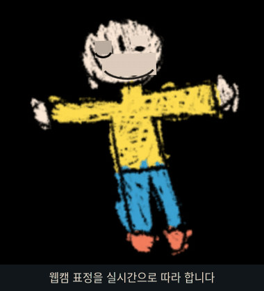
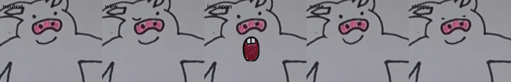
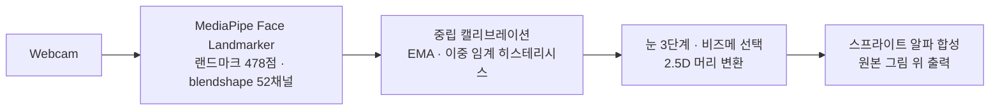
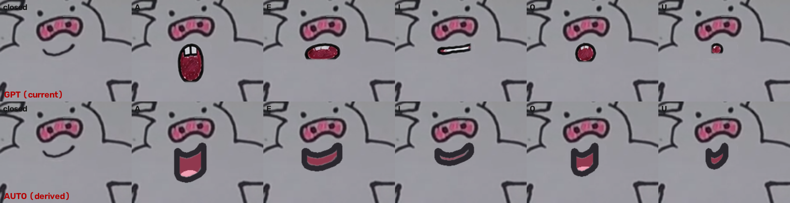
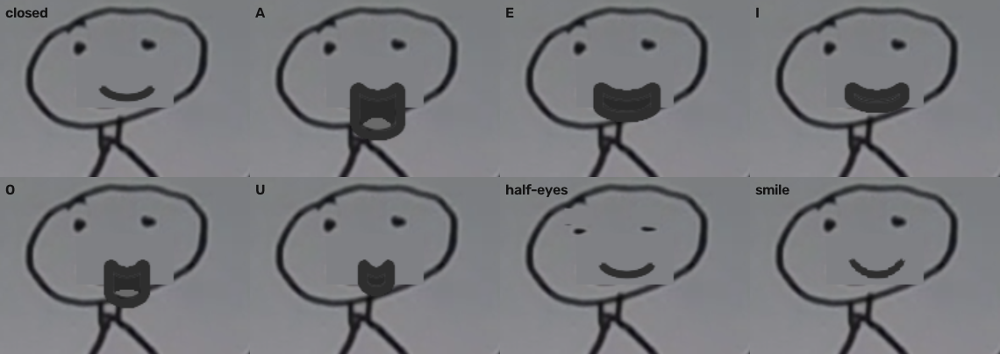
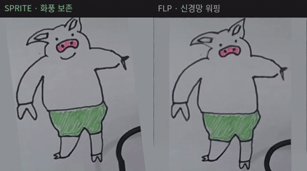

# 🐷 DrawFace Live

**손그림 한 장이 웹캠 표정을 실시간으로 따라 합니다.**
엔진은 둘 — 눈·입 조각을 바꿔 끼우는 **스프라이트 오버레이**(웹, 기본)와 그림 자체를
메시로 구부리는 **ARAP 워프**(데스크톱, 차세대). 둘 다 원본 그림에 없는 픽셀을 만들지
않으므로 화풍이 변형 없이 유지됩니다.

[](https://ingon1026.github.io/drawface-live/)
[](https://ai.google.dev/edge/mediapipe)



<sub>예시 캐릭터로 렌더링한 표정 시퀀스(윙크·깜빡임·입 모양·미소·고개). 웹캠을 켜면 이 동작이 내 표정을 따라 실시간으로 재생됩니다.</sub>



## ▶ 바로 체험

**https://ingon1026.github.io/drawface-live/**

1. 그림 파일을 **드래그앤드롭** — 얼굴 자동 인식이 눈·입 위치를 찾아줍니다 (실패 시 4번 클릭)
2. **시작** → 웹캠 허용 → 정면·무표정으로 잠깐 캘리브레이션
3. 끝 — 윙크, 입 모양(아·에·이·오·우), 미소, 고개 움직임이 그림에 실시간 반영

그림이 아직 없으면 **예시 캐릭터로 체험**을 눌러 바로 시작할 수 있습니다. 새 그림은
저장 전에 기본·눈 감기·미소·입 벌리기 결과를 확인하고 위치를 다시 조정할 수 있으며,
실행 중 **녹화 시작**을 누르면 결과 캔버스만 WebM 영상으로 저장합니다.

추적·합성 전부 브라우저 안에서 실행되고, 캐릭터는 내 브라우저(localStorage)에만 저장됩니다.



## 표정 매핑

| 입력 (blendshape) | 출력 |
| --- | --- |
| `eyeBlinkLeft/Right` | 눈 open / half / closed — 좌우 독립 윙크, 히스테리시스로 떨림 방지 |
| `jawOpen` 크기 | 입 I → E → A 단계 전환 |
| `mouthPucker` / `mouthFunnel` | U / O |
| `mouthSmile` (입 다문 상태) | smile |
| 눈썹·시선 채널 | 눈썹 오프셋·동공 이동 (스프라이트 있는 캐릭터) |
| 얼굴 변환 행렬 | 캔버스 2.5D 이동·회전 |
| 얼굴 소실 | 표정 유지 후 중립으로 감쇠 복귀 |

## 새 캐릭터 = 그림 1장

필요한 손작업은 **눈·입 위치 지정뿐** — 나머지 표정은 그림 자신의 획을 기하 변형해 자동 생성됩니다
(잉크 색·선 두께까지 실제 획에서 샘플링, 새 그림을 "생성"하지 않음).

수제 비즈메(위) vs 자동 파생(아래) — 수제 파일이 있으면 항상 우선:



입이 그려져 있지 않은 캐릭터도 manifest 선언만으로 전체 세트가 나옵니다:



## 데스크톱 버전 (Python · WSL2/Linux)

같은 파이프라인의 네이티브 구현. 웹캠은 usbipd로 WSL에 attach해 사용합니다.

```bash
bash scripts/setup.sh                          # venv + 모델 + 스프라이트 (idempotent)
PYTHONPATH= .venv/bin/python -m app.ui         # 컨트롤 패널 — 스프라이트 모드 (캐릭터·카메라 선택)
PYTHONPATH= .venv/bin/python -m app.onboard <그림> <이름>   # 4클릭 온보딩 도구

# ARAP 워프 모드 (아래 "ARAP 워프 모드" 참고)
PYTHONPATH= .venv/bin/python -m app.warp_live --image <그림.png>            # 얼굴 검출되는 그림
PYTHONPATH= .venv/bin/python -m app.warp_live --character assets/sprites/<이름>  # 4클릭 낙서 캐릭터

PYTEST_DISABLE_PLUGIN_AUTOLOAD=1 PYTHONPATH= .venv/bin/python -m pytest tests/  # 테스트
```

> ROS 등 전역 pytest 플러그인이 설치된 환경에서도 프로젝트 테스트만 실행하도록
> `PYTEST_DISABLE_PLUGIN_AUTOLOAD=1`을 붙입니다.

영상 창 키: `q` 종료 · `c` 재캘리브레이션 · `m` 미러 전환.
임계값·게인은 전부 [`configs/app.yaml`](configs/app.yaml)에서 조정.
스프라이트 규약: [`assets/sprites/README.md`](assets/sprites/README.md)

> 카메라는 한쪽만 씁니다 — 웹앱은 Windows 카메라, 파이썬 앱은 WSL attach(`usbipd attach --wsl --busid <id>`).

### 카메라가 안 잡힐 때 (`/dev/video*` 없음)

**attach는 Windows 재부팅마다 풀립니다.** 커널 문제가 아니라 십중팔구 이것입니다 — PowerShell(관리자)에서:

```powershell
usbipd list                        # RealSense D455 의 BUSID 확인 (STATE 가 Shared 여도 attach 는 별도)
usbipd attach --wsl --busid 2-1    # 그 순간 WSL 에 /dev/video0~5 생성
```

- WSL 쪽 확인: `ls /dev/video*` — 권한이 `crw-rw-rw-`라 sudo 불필요
- 노드 판별(D455): **video4 = 깨끗한 RGB**(`configs/app.yaml`의 `index: 4`), video2 는 IR 도트 혼입, video0 은 depth
- 최초 1회만: `usbipd bind --busid 2-1` (Shared 로 만들기). 이후 재부팅엔 attach 만 다시

## 왜 결정론 방식인가 — 신경망 실측 비교

"사진 한 장이면 알아서 움직여주는" 신경망 모델 두 계열을 같은 조건에서 실측한 뒤
결정론(스프라이트·워프) 노선을 확정했습니다.

**① 워핑 계열 — [FasterLivePortrait](https://github.com/warmshao/FasterLivePortrait)**
는 실사 얼굴로 학습돼 입력이 실제 얼굴에 가까워야 동작합니다:

| 소스 | FLP 얼굴 검출 | 결과 |
| --- | --- | --- |
| 실사 얼굴 사진 | ✅ | 자연스럽게 워핑 (FLP의 강점) |
| 손그림(돼지) | ❌ human 실패 → animal만 | 머리 전체 워핑·뭉개짐 + paste-back 사각 자국 |
| **플랫 디지털 아바타** | **❌ human 실패** (손그림과 동일) | animal로 구동되나 얼굴 변형 |

같은 그림 + 같은 표정 클립 비교 (`scripts/sprite_video.py`로 재현):



**② 디퓨전 계열 — [PersonaLive](https://github.com/GVCLab/PersonaLive)** (CVPR 2026,
실시간 스트리밍)도 실측: 일러스트가 **구동은 되지만** 출력이 모델의 학습 화풍(준실사)으로
**재생성**됩니다 — 왕눈·선 입 같은 캐릭터 디자인이 사라지고 프레임마다 얼굴이 드리프트.
실사 소스에서는 우수했으나(VRAM 피크 11.9GB, 4070 Ti 오프라인 ~3fps) 그림 도메인은 탈락.

결론: 갈림점은 매체가 아니라 **"실사에 얼마나 가까운가"**이고, 그림 도메인에서 화풍을
지키는 유일한 방법은 **원본 픽셀 밖을 만들지 않는 결정론 변형**입니다. 이건 업계 표준이기도
합니다(Live2D·Adobe Character Animator·Meta Animated Drawings 전부 이 방식).
측정치·재현 절차: [`outputs/benchmark.md`](outputs/benchmark.md).

## ARAP 워프 모드 (차세대 엔진)

스프라이트의 남은 약점 — 패치 교체 경계의 "붙인 티" — 를 원리적으로 없앤 두 번째 엔진.
[Meta AnimatedDrawings](https://github.com/facebookresearch/AnimatedDrawings)의 ARAP
솔버(MIT, 단일 파일 벤더링) 위에 메시 자동 생성과 표정 채널을 얹었습니다
([`app/warp_rig.py`](app/warp_rig.py)). 눈·입을 지우고 붙이는 대신 **그림 자체의 획이
움직이므로** 볼·주변부까지 자연스럽게 따라갑니다.

| | 스프라이트 오버레이 | ARAP 워프 |
| --- | --- | --- |
| 원리 | 눈·입 조각 교체 | 제어점 이동 → 메시 변형 |
| 표정 | 이산 상태 (open/half/closed, 비즈메) | 연속 채널 (blink L/R · smile · jaw, 0~1) |
| 강점 | 완전 감김·입 안쪽까지 명확한 상태 표현 | 붙인 티 0, 부드러운 중간 표정 |
| 완전 감김·입 내부 | 스프라이트 교체 | **하이브리드 레이어** — 워프된 메시를 따라가는 폴리곤에 그림에서 샘플한 색으로 그림 (박스 아님 → 붙인 티 없음) |
| 지원 | 웹 + 데스크톱 | 데스크톱 (WebGL 포트 예정) |

두 입력 루트가 같은 엔진으로 수렴합니다:

- **얼굴이 검출되는 그림** (일러스트 등): MediaPipe 랜드마크 478점 → 메시 자동 생성 — `--image`
- **검출 안 되는 낙서** (졸라맨·크레용): 온보딩 4클릭 박스 → 가상 랜드마크 합성 — `--character`

```bash
PYTHONPATH= .venv/bin/python -m app.warp_live --image <그림.png>                 # 라이브 (웹캠)
PYTHONPATH= .venv/bin/python -m app.warp_live --character assets/sprites/<이름>
PYTHONPATH=. .venv/bin/python scripts/warp_demo.py --image <그림.png> --out outputs/warp_demo  # 오프라인 스틸
```

512² 기준 프레임당 solve+렌더 ≈ 5~9 ms(CPU)로 실시간 여유가 큽니다. 게인은
[`configs/app.yaml`](configs/app.yaml)의 `warp:` 섹션.

완전 눈감김은 blink 0.7→1.0 구간에서 눈꺼풀 실(폴리곤 채움+감김 선)이 알파로 차올라
**팝 없이 연속으로** 닫히고, 입 내부는 jaw가 커지면 입술 링이 실제로 분리되며 그 사이가
입안색으로 채워집니다. 색은 전부 그림 자체에서 샘플(눈 주변 밝은 픽셀 중앙값 = 눈꺼풀,
어두운 분위수 = 잉크선) — 새 그림을 생성하지 않습니다.

로드맵: WebGL 포트 — 웹앱 엔진 교체.

## 프라이버시

- 웹캠 영상은 **어디로도 전송·저장되지 않습니다** (웹: 브라우저 내 처리, 데스크톱: 로컬 처리)
- **녹화(웹, 선택 기능)**: 기본 꺼짐. `녹화 시작`을 눌렀을 때만, 그리고 **웹캠 화면이 아니라 캐릭터 결과 캔버스만** WebM으로 저장(내 기기로 직접 다운로드). 녹화 중에는 버튼이 `녹화 종료`로 바뀌어 상태가 드러납니다
- 텔레메트리·분석·계정 없음
- 추적 모델은 MediaPipe 공식 저장소에서 로드

## 구조

```text
docs/     웹앱 (GitHub Pages 루트) — 정적 파일, 빌드 없음
app/      데스크톱 파이프라인 (config · camera · tracker · compositor · UI · onboard · warp_rig · warp_live)
scripts/  setup · diagnose · 스프라이트 파생 · 워프 데모 · FasterLivePortrait 실행
tests/    시맨틱 매핑 · 상태머신 · 설정 · 온보딩 · 워프 리그 검증
third_party/FasterLivePortrait   평가용 업스트림 (서브모듈, 무수정)
third_party/animated_drawings    ARAP 솔버 (MIT, 단일 파일 벤더링)
```
