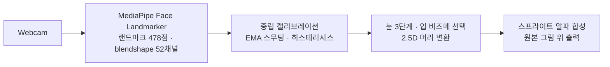

# DrawFace Live

한 장의 손그림 캐릭터가 웹캠 표정을 실시간으로 따라 합니다. 원본 그림의 획은 그대로 두고
눈·입 스프라이트만 교체 합성하므로 **화풍이 변형 없이 유지**됩니다.




## 빠른 시작

요구 사항: Linux/WSL2(WSLg), Python 3.12, [uv](https://docs.astral.sh/uv/), 웹캠.

```bash
bash scripts/setup.sh                     # venv + 추적 모델 + 스프라이트 (idempotent)
PYTHONPATH= .venv/bin/python -m app.main  # 실행
```

시작 후 30프레임 동안 정면·무표정을 유지하면 중립 기준이 자동 보정됩니다.
창 왼쪽은 웹캠 프리뷰(미러, 랜드마크·신호 바 오버레이), 오른쪽은 캐릭터 출력입니다.

| 키 | 동작 |
| --- | --- |
| `q` / `ESC` | 종료 |
| `c` | 중립 재캘리브레이션 |
| `m` | 윙크 좌우 매핑 전환 (미러 ↔ 해부학적) |

다른 캐릭터 실행:

```bash
PYTHONPATH= .venv/bin/python -m app.main --character assets/sprites/stick
```

CLI 대신 컨트롤 패널(캐릭터·카메라 선택, 미러/프리뷰/시각화 토글, 시작·정지)로도 실행할 수 있습니다:

```bash
PYTHONPATH= .venv/bin/python -m app.ui
```

## 표정 매핑

| 입력 (blendshape) | 출력 |
| --- | --- |
| `eyeBlinkLeft` / `eyeBlinkRight` | 눈 open / half / closed — 좌우 독립, 이중 임계 히스테리시스로 떨림 방지 |
| `jawOpen` 크기 | 입 I → E → A 단계 전환 |
| `mouthPucker` / `mouthFunnel` | U / O |
| `mouthSmile` (입 다문 상태) | smile |
| 눈썹 blendshape (`browInnerUp`·`browOuterUp`·`browDown`) | 눈썹 스프라이트 상하 오프셋 — manifest `browRange`>0 + `brow_L/R.png`일 때 |
| 시선 (`eyeLook*` 8채널) | 동공 스프라이트 이동(깜빡임 중 감쇠) — manifest `pupilRange`>0 + `pupil_L/R.png`일 때 |
| 얼굴 변환 행렬 (yaw/pitch/roll) | 캔버스 2.5D 이동·회전 |
| 얼굴 소실 | 마지막 표정 유지 후 중립으로 감쇠 복귀 |

모든 임계값·게인은 [`configs/app.yaml`](configs/app.yaml)에서 조정합니다.

## 새 캐릭터 추가

그림 한 장에서 시작하는 가장 빠른 길 — **온보딩 도구로 4번 클릭**:

```bash
PYTHONPATH= .venv/bin/python -m app.onboard <그림파일> <이름>
```

왼눈 → 오른눈 → 입 좌상단 → 입 우하단 순서로 클릭하면 (잉크 중심 자동 스냅)
base 인페인트·눈 스프라이트·manifest 생성과 표정 파생까지 한 번에 끝나고,
컨트롤 패널 드롭다운에 바로 나타납니다.

수동으로 만들 때는 `assets/sprites/<이름>/`에 아래 파일만 두면 나머지 표정 스프라이트는 자동 파생됩니다.

```text
base.png                          # 캐릭터 원본 (512×512, 눈 자리 비움)
eye_L_open.png  eye_L_closed.png  # 눈 4장 (전체 캔버스 RGBA 오버레이)
eye_R_open.png  eye_R_closed.png
mouth_closed.png                  # 다문 입 1장 — manifest가 proceduralMouth: true면 생략 가능
manifest.json                     # mouthCenter, mouthStyle 색상
```

```bash
PYTHONPATH= .venv/bin/python scripts/derive_sprites.py assets/sprites/<이름>                                        # half-eye · smile
PYTHONPATH= .venv/bin/python scripts/derive_sprites.py assets/sprites/<이름> --auto-mouths assets/sprites/<이름>    # A/E/I/O/U
```

자동 비즈메는 캐릭터의 다문 입 획을 입술로 재사용하고(잉크 색·선 두께를 실제 획에서 샘플링)
내부만 manifest 색으로 채웁니다. 수제 비즈메 파일이 있으면 항상 그쪽이 우선하며,
`--auto-mouths`는 기존 세트를 `--force` 없이 덮어쓰지 않습니다.

수제(위) vs 자동 파생(아래):


입 그림이 전혀 없는 캐릭터도 `proceduralMouth: true` 선언만으로 전체 세트가 생성됩니다:


상세 규약: [`assets/sprites/README.md`](assets/sprites/README.md)

## 테스트

```bash
PYTHONPATH= .venv/bin/python -m pytest tests/
```

윙크 좌우 시맨틱 매핑(미러 모드에서도 의미가 뒤집히지 않음), 히스테리시스 상태 전이,
비즈메 선택 사다리, 설정 검증을 포함합니다.

## 신경망 엔진 평가

스프라이트 방식 채택 전에 [FasterLivePortrait](https://github.com/warmshao/FasterLivePortrait)
(commit `8aad360`, Docker ONNX GPU, RTX 4070 Ti)를 라이브 웹캠으로 평가했습니다.
human 모드는 손그림에서 소스 얼굴을 검출하지 못했고, animal 모드(XPose)는 구동되지만
실사 학습 워핑 모델 특성상 선화의 머리 영역이 심하게 변형됩니다(~8.4 FPS).
측정 수치와 재현 절차: [`outputs/benchmark.md`](outputs/benchmark.md)

```bash
bash scripts/run_animal.sh /dev/video4    # 신경망 경로 재현 (요 Docker + usbipd 웹캠)
```

## 프라이버시

웹캠 프레임은 로컬에서만 처리되며 어떤 경로로도 저장·전송되지 않습니다.
텔레메트리 없음. 추적 모델(face_landmarker.task)은 MediaPipe 공식 저장소에서 받습니다.
